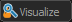
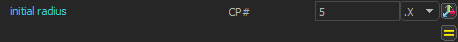
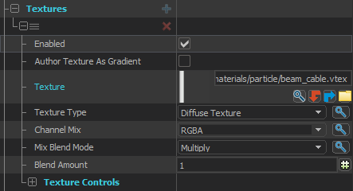
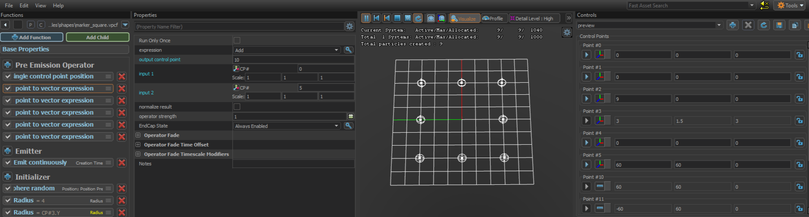
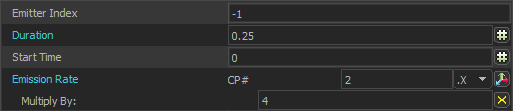

# Creating Particles for CS2Draw

CS2Draw renders shapes using custom `.vpcf` particle files built in the **CS2 Particle Editor Tool (PET)**. This guide
covers the basics of building a functional particle effect.

> For a real-world example of what's possible,
> see [Letaryat's CS2-CustomTrailAndTracers](https://github.com/Letaryat/CS2-CustomTrailAndTracers) — the project that
> inspired CS2Draw, or [Jailbreak](https://github.com/edgegamers/Jailbreak) — A plugin which heavily uses CS2Draw and
> was
> designed for initially.

---

## Requirements

- [CS2 Workshop Tools](https://developer.valvesoftware.com/wiki/Counter-Strike_2_Workshop_Tools/Installing_and_Launching_Tools)
  Installed
- **The [**CS2 Particle Editor
  **](https://developer.valvesoftware.com/wiki/Counter-Strike_2_Workshop_Tools/Particles#Enabling_the_Particle_Editor) (
  _disabled by default_)**
- An [Addon Created](https://developer.valvesoftware.com/wiki/Counter-Strike_2_Workshop_Tools/Introduction#New_Addon) in
  Workshop Tools

---

## Understanding The Particle Editor

The Particle Editor Tool (PET) is a tool that allows you to create and edit particle effects. It's probably the most
versatile and powerful tool in the Workshop that allows you to create complex effects with a lot of control over how
they behave. However, it's a bit of a learning curve to get used to.

The PET is split into three main areas:

```
┌─────────────────────┬──────────────────────────────┬────────────────────────┬─────────────────────┐
│   Functions Panel   │       Preview Viewport       │    Properties Panel    │  Controls Panel     │ 
│  (left most column) │           (center)           │    (right of funcs)    │   (top right)       │
│                     │                              │                        │                     │
│  The tree of all    │  Real-time preview of your   │  Settings for whatever │  Allows you to set  │
│  operators that     │  particle. Use the controls  │  node is selected in   │  and visualize CPs  │
│  make up your       │  at the top to play, pause,  │  the Functions panel.  │  for testing your   │
│  particle system.   │  restart, or stop the sim.   │                        │     particles.      │
└─────────────────────┴──────────────────────────────┴────────────────────────┴─────────────────────┘
```

## Functions Panel

This is where you build your particle. It contains sections for each function type — clicking
the  next to any section lets you add a new function of
that type:

| Section                    | Purpose                                                          |
|----------------------------|------------------------------------------------------------------|
| **Base Properties**        | Top-level settings: duration, emission rate, max particles       |
| **Pre Emission Operators** | Run once before particles spawn — used to set CP defaults        |
| **Emitter**                | Controls how and when particles are created                      |
| **Initializer**            | Sets each particle's starting state (position, radius, color)    |
| **Operator**               | Runs every frame on all live particles (movement, fading, decay) |
| **Renderer**               | Defines how particles are drawn on screen                        |
| **Children**               | References to child particle systems linked to this one          |

Functions are run top to bottom in the order they appear in the Functions panel.

### Properties Panel

Click any node in the Functions panel to see its properties on the right. Property types you'll encounter:

- **Scalar** — a single float value
- **Vector** — three floats (X, Y, Z)
- **Boolean** — a checkbox
- **Enumerated list** — a dropdown of options
- **Asset reference** — a path to a texture or child effect

### The  Icon — Expression Picker

Any property that shows the ** icon** next to it
can be driven by something other than a hardcoded value. Clicking it opens the expression picker — a list of dynamic
input sources including:

- **Literal Float** — just a fixed number
- **CP Component** — read a value from a specific component (X, Y, or Z) of a Control Point
- **Vector Expressions** — all the values of a vector
- **Random Uniform / Random Biased** — randomized values
- **Particle Age Curves**, **Per-Particle Number Curves**, and many more

This is how you wire CP values into particle properties — for example, setting a radius to read from `CP5.X` so CS2Draw
can control it from code.

### Preview Viewport

The viewport shows your particle in real time. Key controls at the top:

| Button                                                               | Action                                                                                                        |
|----------------------------------------------------------------------|---------------------------------------------------------------------------------------------------------------|
|  | Pause or resume the simulation                                                                                |
|       | Kill all particles and start fresh                                                                            |
|              | Stop emission but let existing particles decay naturally                                                      |
|    | Shows selected indicators — default is radius — useful when you can't see color because no CP tint is set yet |

> You won't see your tint color in the PET preview because CS2Draw sets color via Control Points at runtime. Use *
*Visualize** to confirm your particle is working while editing.

---

## Understanding Control Points 

Control Points (CPs) are how CS2Draw passes data into your particle at runtime. Each CP is a **Vector (X, Y, Z)** — it
can carry a world position, or you can use individual components to pass in numbers.

### CP0 — Always the Origin

**CP0 is always the position of the `CParticleSystem` entity in the world.** CS2Draw teleports the entity to your
shape's origin before spawning — so CP0 is automatically where your shape should be centered. Never overwrite CP0 in
your particle, but you may reference it in Pre Emission Operators or Initializers.

### Server-Accessible CPs

CS2 only exposes **CP0 through CP6** to server-side code. That's 7 control points total that
`AcceptInput("SetControlPoint")` can reach. Your particle file can use more CPs internally, but those can only be set
from within the PET itself via Pre Emission Operators — not from code.

### CS2Draw's CP Convention

The built-in shapes follow this layout as a general convention. You are **not required** to follow it for custom
shapes — use whatever CPs your particle expects:

| CP  | Component | Used For                                          |
|-----|-----------|---------------------------------------------------|
| CP0 | X Y Z     | Entity origin — set automatically, never override |
| CP1 | X Y Z     | Tint color (scaled 0–1, see Color section)        |
| CP2 | X         | Particle count / emission density                 |
| CP3 | X         | Particle Radius                                   |
| CP3 | Y         | Alpha                                             |
| CP3 | Z         | Open                                              |
| CP4 | X Y Z     | Open                                              |
| CP5 | X         | Primary geometry (radius, width)                  |
| CP5 | Y         | Secondary geometry (height)                       |
| CP6 | X Y Z     | Open                                              |

### Using the Expression Picker to Read a CP

To make a property read from a CP component:

1. Click the ** icon** next to the property
2. Select ** CP Component** from the list
3. Set the CP number and choose the component (X, Y, or Z)

For example — wiring a sphere radius to `CP5.X` so CS2Draw can set it from code:

```
Radius → # → CP Component → CP# 5 → X
```

Example using a **Position Along Ring** Initializer we can set the radius like so



--- 

## Renderer, Textures, and Color

For CS2Draw shapes you'll almost always use a **Rope Renderer**. This renderer connects particles sequentially with a
line/beam, which is what produces the outline of a shape.

### Adding a Rope Renderer

1. In the Functions panel click  next to **Renderer**
2. Select **Render Rope**

### Texture

The rope renderer needs a texture to display. A good default for shapes is `materials/particle/beam_cable.vtex` — this
is what the built-in CS2Draw shapes use.

In the renderer properties:

- Under **Textures** add a texture entry
- Set the **Texture** path to `materials/particle/beam_cable.vtex`
- Set **Texture Type** to `Diffuse Texture`
- Set **Channel Mix** to `RGBA`
- Set **Mix Blend Mode** to `Multiply`



### Normal Vector Alignment

The rope renderer needs to know which way to face. In the renderer properties set **Orientation Type** to
`Screen & Particle Normal Align`. This keeps the rope aligned correctly as it traces around a shape. The default Normal
Vector is (0, 0, 1) _up_, but you can change it in any direction using the **Normal** Initializer.

### Color and the 1/255 Multiplier

CS2Draw passes tint color via `CParticleSystem.Tint` which uses standard 0–255 RGB values. However, the PET expects
color
blend values in the **0–1 range**. This means you need to scale incoming CP values down.

In the renderer's **render modifiers** properties go to **color blend**:

1. Click  and select *
   * Control Point Value**, pointing to
   `CP1` (or whichever CP you designate for tint)
2. Set **Scale** to `0.0039` in every box (which is `1 ÷ 255`)
   3Set **color blend type** to `Replace`

This tells the renderer to read RGB from CP1 and scale it into the 0–1 range automatically.

> Since no CP1 value is set inside the PET, you won't see your color in the preview. Use
> the  tool at the top of the viewport to confirm the
> particle is rendering correctly.

### Rope Tesselation

Tesselation controls the smoothness of the rope geometry between particles — more quads means smoother curves.

Recommended defaults for CS2Draw shapes:

| Property                                       | Value | Notes                               |
|------------------------------------------------|-------|-------------------------------------|
| **minimum number of quads per render segment** | `2`   | Keep low for performance            |
| **amount to taper the width of the trail end** | `1`   | No taper — keeps line width uniform |
| **maximum number of quads per render segment** | `128` | Cap for complex curves              |
| **tesselation resolution scale factor**        | `2`   | Balances smoothness vs performance  |

### Color and Alpha Adjustments

Controls how the rope blends into the world and how bright it appears.

Recommended defaults for CS2Draw shapes:

| Property                            | Value      | Notes                                                       |
|-------------------------------------|------------|-------------------------------------------------------------|
| **output blend mode**               | `Additive` | Makes the shape glow and blend naturally with the world     |
| **Gamma-correct vertex colors**     | true       | Ensures color accuracy across different lighting conditions |
| **add self amount over alphablend** | `1`        | Full self-illumination blend                                |
| **desaturation amount**             | `0`        | Keep full color saturation                                  |
| **overbright factor**               | `2`        | Boosts brightness — increase for a more intense glow        |
| **HSV Shift Control Point**         | `-1`       | Disabled — set to a CP if you want runtime hue shifting     |

### Lighting and Shadows

Controls whether and how much the particle is affected by world lighting.

For CS2Draw shapes you almost always want full self-illumination, so the shape looks consistent regardless of the map's
lighting:

| Property                                  | Value | Notes                                                      |
|-------------------------------------------|-------|------------------------------------------------------------|
| **Self-Illumination Amount**              | `1`   | Fully self-lit — not affected by world lighting            |
| **Diffuse Lighting Amount**               | `1`   | Keep at 1 unless you want the shape to react to map lights |
| **diffuse lighting origin Control Point** | `-1`  | Disabled                                                   |

---

## Pre-Emission Operators

Pre-Emission Operators run **once before any particles are spawned**. They're used to set up CP defaults and do any math
the particle needs before the emitter fires — without requiring code.

### Set Single Control Point Position

Hardcodes a CP to a specific world position or local offset. Useful for setting a default value for a CP that code might
not always set — acts as a fallback.

### Set Control Point to Vector Expression

This is the powerful one. It lets you **derive a new CP value from math on other CPs**. For example, in the square
shape:

- Multiple `Set control point to vector expression` operators are stacked
- Each one reads from one the origin CP, applies an operation Add's the Radius Times some scalar, and writes the result
  to an output CP
- This is how a single width/height CP can be transformed into the four corner positions the rope renderer needs



**Key properties:**

| Property                 | Description                                        |
|--------------------------|----------------------------------------------------|
| **output control point** | Which CP to write the result to                    |
| **expression**           | The math operation (Add, Subtract, Multiply, etc.) |
| **input 1 / input 2**    | Source CPs and their scale factors                 |

---

## Emitter

The emitter controls **how and when particles are created**.

### Emit Continuously

Spawns particles at a steady rate for a set duration. This is what the built-in shapes use.

**Key properties:**

| Property          | Description                                                                    |
|-------------------|--------------------------------------------------------------------------------|
| **Duration**      | How long emission runs in seconds                                              |
| **Emission Rate** | How many particles per second — wire this to `CP2.X` via the expression picker |

For shapes, you want a short burst rather than a constant stream. The square shape uses:

- **Duration** `0.25`
- **Emission Rate** set to `CP# 2.X` with **Multiply By: 4**



This means CS2Draw sets CP2 to the desired particle count, and the emitter fires `CP2.X × 4` particles over `0.25`
seconds — giving you a controlled fixed count per draw call.

### Emit Instantaneously

Spawns all particles at once in a single frame. Simpler than Emit Continuously for cases where you want everything to
appear at the same time. (Beacons use these)

---

## Initializers

Initializers set each particle's **starting state** at the moment it's created. They run once per particle.

### Position Within Sphere Random

Places particles randomly within a sphere around a control point. For shapes this is typically combined with a tiny
radius so particles cluster tightly, and the actual shape position comes from the Pre Emission Operators setting CPs to
corner/arc positions.

**Key properties:**

| Property                 | Description                          |
|--------------------------|--------------------------------------|
| **control point number** | Which CP to spawn around (usually 0) |
| **distance bias**        | Scales the spread per axis           |

### Radius

Sets the visual size of each particle. For shape outlines you typically want a small consistent radius.

- **Literal value** — fixed size
- **CP-driven** — wire to a CP component via `#` so CS2Draw can control thickness

In Image 2 you can see two Radius initializers stacked — one sets a literal base value, and one reads from `CP#3.Y` to
allow code-driven radius override.

### Normal

Sets the particle's normal direction. For rope-rendered shapes set this to point outward from the shape plane (usually
`0 0 1` for a flat ground-plane shape) so the rope faces the camera correctly.

### Position Along Path Sequential

Places particles evenly along a path defined by two or more control points — a start CP and an end CP. Particles are
distributed
in sequence from CP to CP, making it ideal for drawing straight line segments between two or more world positions.

**Key properties:**

| Property                     | Description                                                                        |
|------------------------------|------------------------------------------------------------------------------------|
| **start control point**      | CP defining the start of the path (e.g. CP10)                                      |
| **end control point**        | CP defining the end of the path (e.g. CP14)                                        |
| **particles to map to path** | How many particles to distribute along the path — wire to `CP2.X` for code control |

This is the initializer used by shapes like the rectangle where each side is a straight line between two known corner
positions set by Pre Emission Operators.

### Position Along Ring

Places particles evenly around a ring (circle) centred on a control point. Each particle gets a sequential position
around the circumference, making it the natural choice for circle and ellipse shapes.

**Key properties:**

| Property                     | Description                                                        |
|------------------------------|--------------------------------------------------------------------|
| **control point number**     | CP at the center of the ring (usually CP0 — the entity origin)     |
| **radius**                   | Size of the ring — wire to `CP5.X` so CS2Draw can set it from code |
| **particles to map to path** | Total particles distributed around the ring — wire to `CP2.X`      |

### Finding More Position Initializers

There are many more position initializers available beyond these two — along a grid, within a cone, on a mesh, and more.
When adding an initializer, **type "position" in the search bar** to filter the full list and find one that suits your
needs.

---

## Uploading Your Addon

Once your `.vpcf` is saved inside your addon's `particles/` folder:

1. In The **Asset Browser**, right-click your particle and select **Recompile → Full**
2. In Workshop Tools go to **File → Publish Addon**
3. Fill in the title, description, and preview image
4. Click **Upload** — this gives you a **Workshop ID**
5. You must wait for steam to approve the item before it's available for use

### Mounting with MultiAddonManager

Add the Workshop ID to your `multiaddonmanager.cfg`:

```
mm_extra_addons "YOUR_WORKSHOP_ID"
```

### Registering in cs2draw.json

Add the `.vpcf` path to your CS2Draw config so the service can resolve it:

```json
{
  "custom": {
    "my_shape": "particles/myaddon/my_shape.vpcf"
  }
}
```

The path is relative to the game's `particles/` directory inside your addon.

---

## Troubleshooting

**Nothing renders at all**

- Check the server console for `[CS2Draw] No effect found for key '...'` — your key in `cs2draw.json` doesn't match what
  you're passing to `.RegisterShape()`
- Make sure your addon is mounted and the Workshop ID is in MultiAddonManager
- Confirm the `.vpcf` path in `cs2draw.json` exactly matches where the file is in your addon

**Shape renders but the wrong color / tint is ignored**

- Your color blend in the renderer isn't wired to CP1 — see the Color section above
- Double-check the `0.0039` scale factor is applied to all three elements
- Confirm `TintCP` in your `IShapeSetup` matches the CP your renderer reads from

**Particles appear at the wrong position**

- CP0 is the entity origin — CS2Draw sets this via `Teleport()`. If your shape uses a different CP for origin, make sure
  you're not accidentally reading CP0 as a shape parameter
- Check your Pre Emission Operators — a misconfigured vector expression can shift all points by an unexpected offset

**Shape looks wrong / particle count is off**

- For shapes with sides (rectangle, triangle, etc.) the particle count must satisfy `(n × sides) + 1` — pass the right
  count via `.Particles()` or the shape will look broken
- Circle uses a different count method — check the `CircleShapeSetup` in the source for the exact CP layout

**Can't see anything in PET preview**

- No color is set in the PET since tint comes from CP1 at runtime — use
  the  button at the top of the
  viewport to see the particle outline without color